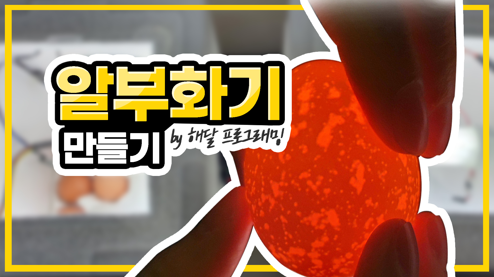

# diyEggIncubator(알부화기)
>  **아두이노**와 **IOT**를 활용한 알부화기를 만들어봅시다!

[ 🎥 알부화기 제작과정 보러가기(YOUTUBE)](https://youtu.be/B8f_P1lXJ2U)

## 사용된 라이브러리
> 아래에서 다운받을 수 있습니다.   

-  [LiquidCrystal_I2C-master](https://github.com/johnrickman/LiquidCrystal_I2C)
-  [Adafruit_Sensor-master](https://github.com/adafruit/Adafruit_Sensor)
-  [DHT_sensor-library-master](https://github.com/adafruit/DHT-sensor-library)

## 사용한 부품
1. Arduino Uno + USB 통신케이블
2. 온습도센서(DHT11)
3. 1CH 릴레이 모듈
4. 전구(20W)
5. I2C 1602 LCD
6. 능동 부저
7. 초음파 가습기 모듈
8. 무탈피커넥터(I-22)
9. 220V 전원케이블
10. 9V DC 어댑터
11. 점퍼선
12. 마이크로 5핀 케이블
13. 온습도계

## 회로 이미지
 

## 완성품

## [ :computer: 완성된 코드 보러가기](diyEggIncubator_code.ino)
